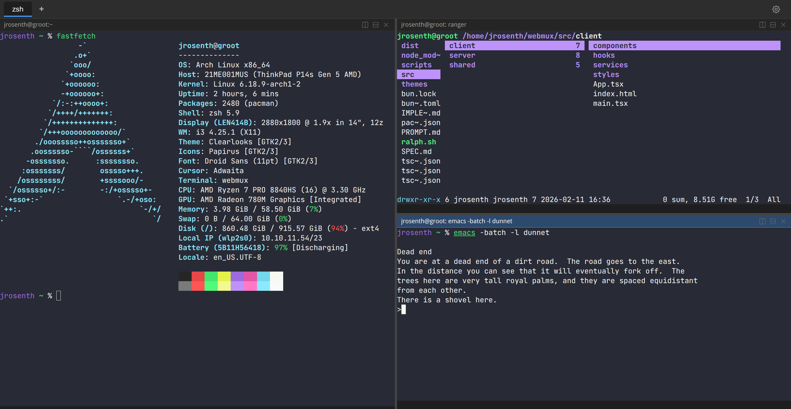

# Webmux

A browser-based terminal multiplexer, similar to tmux but accessed through a web browser. Sessions persist as long as the server is running, so you can close the browser and reconnect later to the same session.



## Features

- **Tabs and splits** — multiple tabs, each with horizontal and vertical pane splitting
- **Drag-to-resize** pane dividers
- **Mouse-follows-focus** — no click required to activate a pane
- **Session persistence** — sessions survive browser close/reopen and are shared across browser tabs
- **100,000-line scrollback** (configurable)
- **Keyboard shortcuts** with a configurable leader key (default `Ctrl+B`), similar to tmux
- **Theming** — color schemes sourced from [Gogh](https://github.com/Gogh-Co/Gogh), plus custom themes
- **Google Fonts integration** — choose from curated monospace fonts
- **Password authentication** with JWT tokens
- **Single binary deployment** — compiles to a self-contained executable with all frontend assets embedded

## Requirements

- [Bun](https://bun.sh) (for building and development)
- Linux x86_64 (for the compiled binary)

## Quick Start

```bash
# Install dependencies
bun install

# Create a config file with your password
mkdir -p ~/.config/webmux
cat > ~/.config/webmux/config.toml << 'EOF'
[auth]
password = "your-password-here"
EOF
chmod 600 ~/.config/webmux/config.toml

# Start the development server
bun run dev
```

Then open `http://localhost:8002` in your browser.

## Production Build

```bash
bun run build
```

This produces a self-contained binary at `dist/webmux` that can be deployed without Bun or Node.js on the target system. The only runtime dependency is glibc 2.25+.

```bash
./dist/webmux
```

## Configuration

Configuration is stored in `~/.config/webmux/config.toml` (override with the `WEBMUX_CONFIG` environment variable).

```toml
[server]
port = 8002

[auth]
password = "your-password-here"
token_validity_days = 14

[terminal]
scrollback_lines = 100000

[appearance]
theme = "Dracula"
font_family = "JetBrains Mono"
font_size = 14

[shortcuts]
leader = "Ctrl+b"
new_tab = "n"
vsplit = "|"
hsplit = "-"
kill_pane = "x"
copy = "Ctrl+Shift+C"
paste = "Ctrl+Shift+V"
```

Most settings can also be changed from the in-app settings dialog (gear icon in the tab bar).

### Environment Variables

| Variable | Default | Description |
|---|---|---|
| `WEBMUX_PORT` | `8002` | Server listen port |
| `WEBMUX_CONFIG` | `~/.config/webmux/config.toml` | Config file path |

## Keyboard Shortcuts

Shortcuts use a leader key system like tmux — press the leader key, then the action key.

| Shortcut | Action |
|---|---|
| `Ctrl+B`, `n` | New tab |
| `Ctrl+B`, `\|` | Vertical split |
| `Ctrl+B`, `-` | Horizontal split |
| `Ctrl+B`, `x` | Kill current pane |
| `Ctrl+Shift+C` | Copy selected text |
| `Ctrl+Shift+V` | Paste from clipboard |

## Security

- Store your config file with restrictive permissions (`chmod 600`)
- Terminate HTTPS at a reverse proxy (nginx, caddy, etc.)
- Terminals run as the user who started the server
- Authentication tokens are stored in HTTP-only cookies
